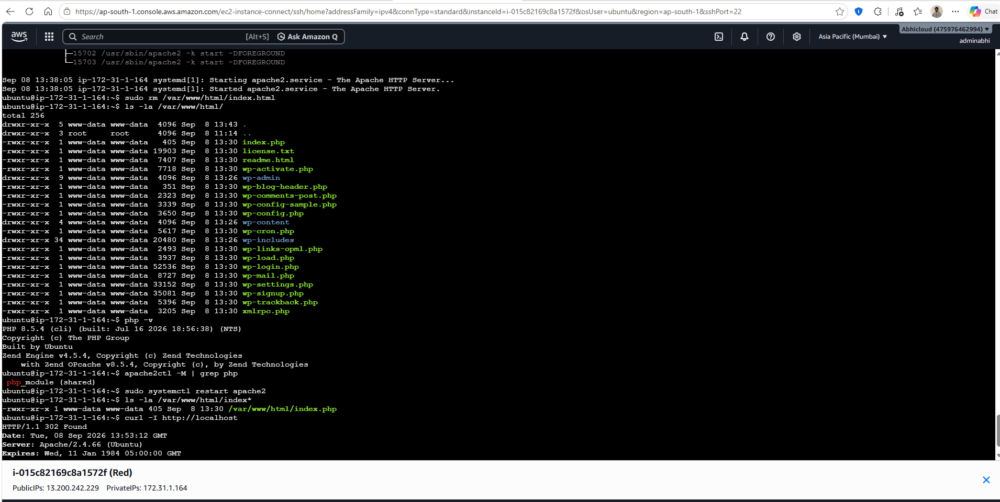
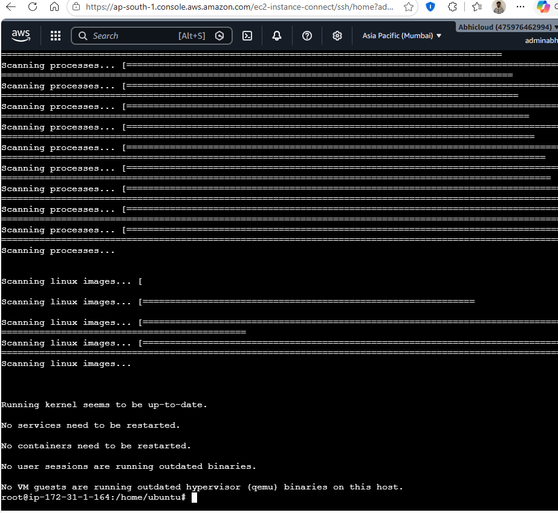
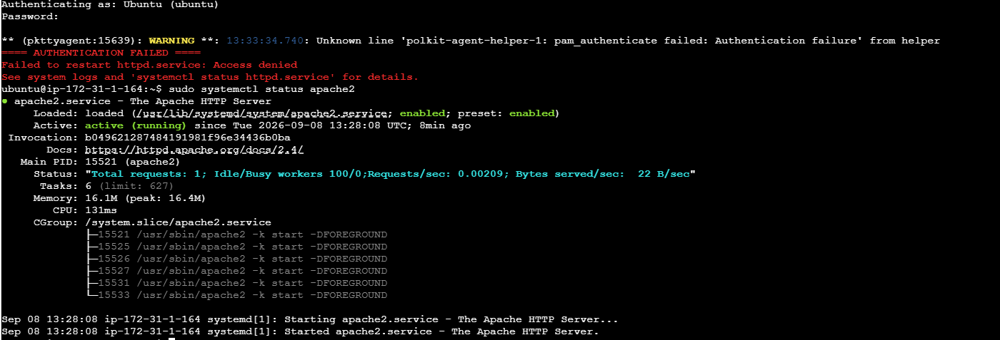
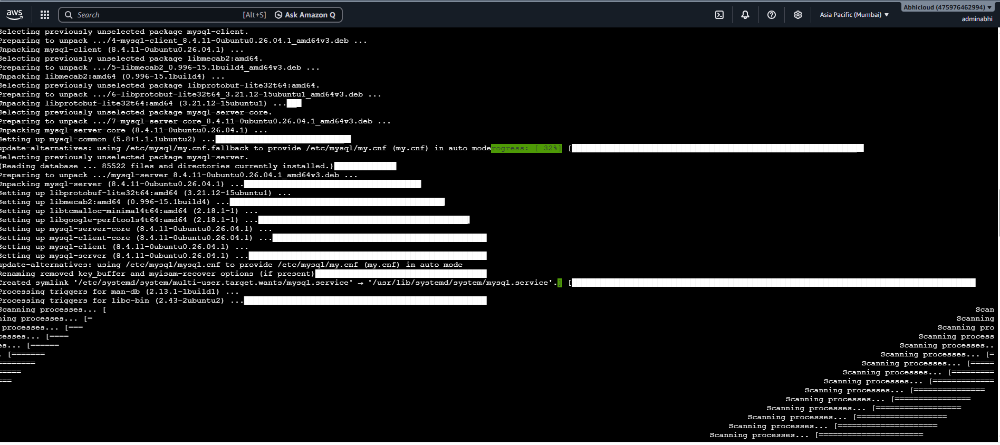
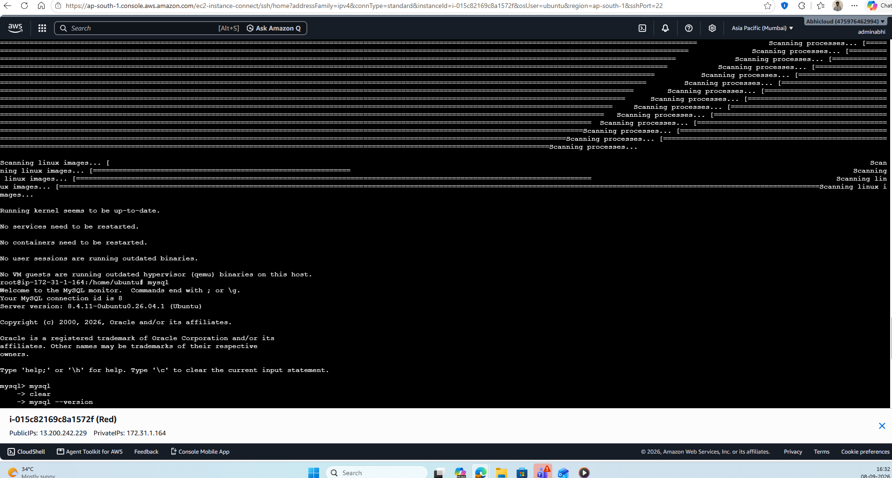
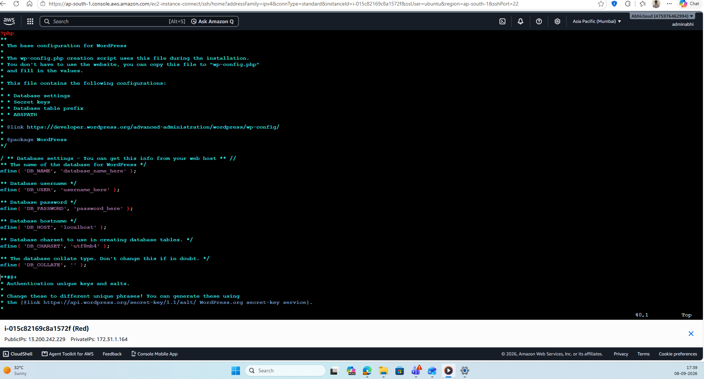
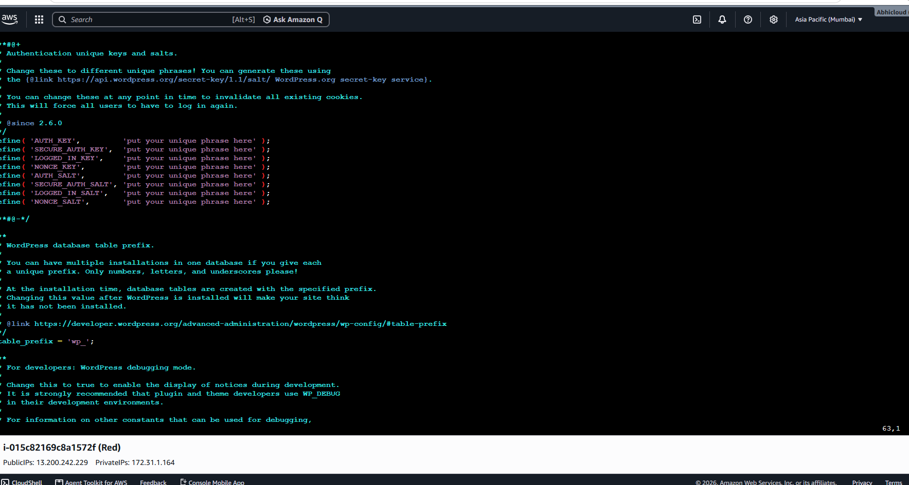

# AWS LAMP Stack WordPress Project

## Project Overview

This project demonstrates the deployment of a WordPress website on an Ubuntu-based Amazon EC2 instance using a LAMP stack architecture.

The application server was configured with Apache as the web server and PHP as the application runtime. Amazon RDS for MySQL was used as the database service, keeping the application and database components separate.

The implementation covers server preparation, web server configuration, MySQL connectivity, WordPress configuration, database integration, security configuration, and application verification.

---

## Project Objectives

The main objectives of this project were:

- Launch and configure an Ubuntu-based Amazon EC2 instance.
- Prepare the server for hosting a web application.
- Install and configure Apache.
- Install and configure PHP and required components.
- Install and configure WordPress.
- Configure Amazon RDS for MySQL as the backend database.
- Install the MySQL client on the EC2 instance.
- Verify connectivity between EC2 and Amazon RDS.
- Configure WordPress to communicate with the RDS database.
- Verify that the WordPress website is accessible through the web server.

---

## Project Architecture

The deployment consists of the following components:

- Amazon EC2 – Application and web server
- Ubuntu Linux – Operating system
- Apache – Web server
- PHP – Application runtime
- WordPress – Web application
- Amazon RDS for MySQL – Database service
- MySQL Client – Used to test database connectivity

### Architecture Flow

Internet  
↓  
Amazon EC2  
↓  
Ubuntu Linux  
↓  
Apache Web Server  
↓  
PHP  
↓  
WordPress  
↓  
Amazon RDS for MySQL

The EC2 instance hosts the WordPress application, while Amazon RDS provides the MySQL database separately.

---

## Step 1: EC2 Instance Setup

An Ubuntu-based Amazon EC2 instance was launched to host the WordPress application.

The EC2 instance acts as the application and web server. After connecting to the instance, the system environment was checked and prepared for the required software installation.

### EC2 Configuration

- Operating System: Ubuntu Linux
- Service: Amazon EC2
- Web Server: Apache
- Application: WordPress
- Database: Amazon RDS for MySQL

### Screenshot

---

## Step 2: Update the Ubuntu System

The Ubuntu package repositories were updated before installing the required packages.

System updates help ensure that the server has the latest available package information and security updates.

The server was updated and restarted as required during the initial configuration.

### Screenshot

---

## Step 3: Install and Configure Apache

Apache was installed and configured as the web server for the WordPress application.

The Apache service was checked after installation to confirm that the service was running correctly.

Apache handles incoming HTTP requests and serves the WordPress application from the EC2 instance.

### Apache Verification

The Apache service status was checked using the system service management commands.

The service was confirmed to be active and running.

### Screenshot

---

## Step 4: Install MySQL Client

The MySQL client was installed on the EC2 instance.

The client is used to connect from the EC2 server to the MySQL database hosted on Amazon RDS.

This provides a way to test database connectivity before configuring WordPress.

### Screenshot

---

## Step 5: Test RDS MySQL Connectivity

After installing the MySQL client, a connection was established from the EC2 instance to the Amazon RDS MySQL database.

This step verified that the EC2 instance could communicate with the RDS database endpoint.

The database connection was successfully established and the MySQL server was accessed from the EC2 instance.

### Screenshot

---

## Step 6: Configure WordPress Database Connection

WordPress was configured to use Amazon RDS as its database backend.

The WordPress database configuration was updated with the required database information, including:

- Database name
- Database username
- Database password
- RDS database endpoint
- Database character set
- Database table prefix

The configuration allows WordPress running on EC2 to communicate with the MySQL database hosted on Amazon RDS.

### Screenshot

---

## Step 7: Configure WordPress Security Settings

The WordPress configuration file contains security-related settings such as authentication keys and salts.

These values help protect WordPress authentication and user sessions.

The WordPress configuration was reviewed and the required security settings were configured.

### Screenshot

---

## Step 8: WordPress Setup Verification

After configuring the web server and database connection, the WordPress setup page was accessed through the EC2 web server.

This confirmed that the WordPress application was being served correctly by Apache and could communicate with the configured database.

### Screenshot

---

## Step 9: WordPress Website Verification

The WordPress home page was accessed through the EC2 instance public address.

This final verification confirmed that the web server, PHP runtime, WordPress application, and database connection were working together.

### Screenshot

---

## Database Verification

The MySQL client was used to establish a connection with the Amazon RDS MySQL database.

The database connection was verified from the EC2 instance, confirming communication between the application server and the database service.

The WordPress database was available on the RDS instance and was used by the WordPress application.

---

## Application Verification

The WordPress setup page and home page were accessed through the EC2 web server.

The following components were verified:

- Apache web server was running.
- PHP was available for the WordPress application.
- WordPress files were accessible.
- EC2 could communicate with Amazon RDS.
- WordPress was configured to use the RDS MySQL database.
- The WordPress website was accessible through the EC2 public address.

---

## Key Learning Outcomes

This project provided practical experience with:

- Amazon EC2
- Ubuntu Linux
- Apache web server
- PHP
- WordPress
- Amazon RDS for MySQL
- MySQL
- Linux package management
- Database connectivity
- WordPress configuration
- Web server administration
- AWS application deployment
- Basic troubleshooting and verification

The project also provided practical understanding of how an application server and database service can be separated into different infrastructure components.

---

## Project Benefits

Using Amazon EC2 for the application server and Amazon RDS for the database provides a clear separation between the web application and database layers.

This architecture makes it easier to manage the application and database independently and provides a foundation for future improvements.

Possible future enhancements include:

- Application Load Balancer
- Multiple EC2 instances
- Auto Scaling
- CloudWatch monitoring
- HTTPS using SSL/TLS
- Route 53 DNS configuration
- Database backups and monitoring
- High-availability architecture

---

## Conclusion

This project demonstrates the deployment of a WordPress application using an AWS-based LAMP stack architecture.

The EC2 instance provides the application and web-serving environment, while Amazon RDS provides the MySQL database layer.

The implementation covered server preparation, Apache configuration, MySQL connectivity, WordPress configuration, database integration, security settings, and application verification.

The project provides a practical foundation for understanding how a web application can be deployed on cloud infrastructure using separate application and database services.
