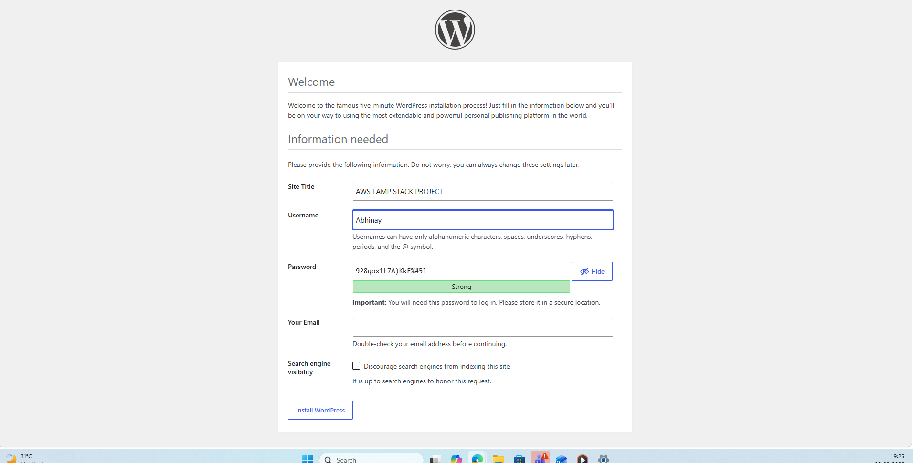
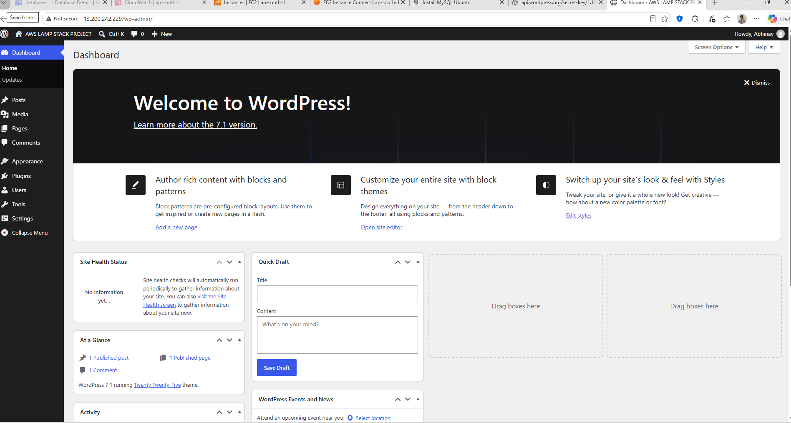

# AWS LAMP Stack WordPress Project

## Project Overview

This project demonstrates the deployment of a WordPress website on an Ubuntu-based Amazon EC2 instance using a LAMP stack architecture.

The EC2 instance was configured as the application and web server. Apache was used to handle web requests, PHP was configured as the application runtime, and WordPress was deployed as the web application.

Amazon RDS for MySQL was used as the database service. This separates the application server from the database layer and provides a simple two-tier architecture.

The project covers server preparation, web server configuration, MySQL connectivity, WordPress configuration, security settings, and application verification.

---

## Project Objectives

The main objectives of this project were:

- Configure an Ubuntu-based Amazon EC2 instance.
- Update and prepare the Linux server.
- Install and configure Apache.
- Install PHP and the required components.
- Deploy WordPress on the EC2 instance.
- Use Amazon RDS as the MySQL database.
- Install the MySQL client on the EC2 server.
- Verify connectivity between EC2 and RDS.
- Configure WordPress with the database details.
- Verify that the WordPress website is accessible.

---

## Project Architecture

The deployment consists of the following components:

- Amazon EC2 – Application and web server
- Ubuntu Linux – Operating system
- Apache – Web server
- PHP – Application runtime
- WordPress – Web application
- Amazon RDS for MySQL – Database service
- MySQL Client – Used to test database connectivity

### Architecture Flow

```text
                         Internet
                            |
                            |
                     Amazon EC2
                    Ubuntu Linux
                            |
                         Apache
                            |
                           PHP
                            |
                        WordPress
                            |
                            |
                    MySQL Connection
                            |
                            v
                  Amazon RDS for MySQL
                         Database
Implementation Steps
1. EC2 Web Server Setup

An Ubuntu-based Amazon EC2 instance was used as the application server.

The EC2 instance provides the compute environment required to host the WordPress application and its supporting services.

2. Ubuntu System Update

The Ubuntu operating system was updated before installing the required application packages.

System updates help ensure that the server has the latest available package information and security updates before proceeding with the deployment.

3. Apache Web Server

Apache was configured as the web server for the WordPress application.

The Apache service was checked using the system service manager to confirm that it was enabled and running correctly.

The service status confirmed that Apache was active and running on the EC2 instance.

4. MySQL Client Installation

The MySQL client was installed on the EC2 instance.

The client is required to establish a connection from the EC2 server to the MySQL database hosted on Amazon RDS.

This also provides a way to verify database connectivity from the application server.

5. MySQL Database Connectivity

After installing the MySQL client, a connection was established to the MySQL database.

The connection was used to verify communication between the EC2 instance and the database service.

The MySQL client also allows database information to be checked from the EC2 server.

6. WordPress Database Configuration

WordPress was configured with the required database information.

The configuration includes:

Database name
Database username
Database password
Database host
Database table prefix

The WordPress configuration file is located at:

/var/www/html/wp-config.php

The database host was configured to use the Amazon RDS MySQL endpoint.

7. WordPress Security Configuration

The WordPress configuration file contains authentication keys and salts used by WordPress to protect authentication cookies and user sessions.

These security values were reviewed as part of the WordPress configuration.

8. WordPress Setup

After configuring the web server and database connection, the WordPress setup page was accessed through the EC2-hosted web server.

This confirmed that the WordPress application was being served successfully by Apache.



9. WordPress Home Page Verification

The WordPress home page was accessed after completing the application configuration.

This provided the final verification that the WordPress application was available through the web server.



Project Workflow

The complete implementation followed this sequence:

Created an Ubuntu-based EC2 instance.
Connected to the EC2 instance.
Updated the Ubuntu operating system.
Installed and configured Apache.
Installed PHP and the required components.
Installed and configured WordPress.
Created and configured the MySQL database using Amazon RDS.
Installed the MySQL client on the EC2 instance.
Tested connectivity between EC2 and RDS.
Configured WordPress to use the RDS database.
Reviewed WordPress security configuration.
Accessed the WordPress setup page.
Verified the WordPress home page.
Verification

The deployment was verified at multiple stages.

Apache Verification

The Apache service was checked using:

sudo systemctl status apache2

The service was confirmed to be active and running.

Database Verification

The MySQL client was used to establish a connection with the RDS MySQL database.

This confirmed that the EC2 instance could communicate with the database service.

WordPress Verification

The WordPress setup page and home page were accessed through the web server to verify that the application was running correctly.

Key Learning Outcomes

This project provided practical experience with:

Amazon EC2
Ubuntu Linux
Apache
PHP
WordPress
Amazon RDS
MySQL
Linux package management
Database connectivity
WordPress configuration
Web server administration
AWS application deployment

The project also provided practical understanding of how an application server and database service can be separated into different infrastructure components.

Conclusion

This project demonstrates a complete basic WordPress deployment using an AWS-based LAMP stack architecture.

The EC2 instance provides the application and web-serving environment, while Amazon RDS provides the MySQL database layer.

The implementation covered server preparation, web server configuration, database connectivity, WordPress configuration, security settings, and final application verification.

This deployment provides a foundation for further improvements such as load balancing, multiple EC2 instances, monitoring, automated backups, and high availability.
